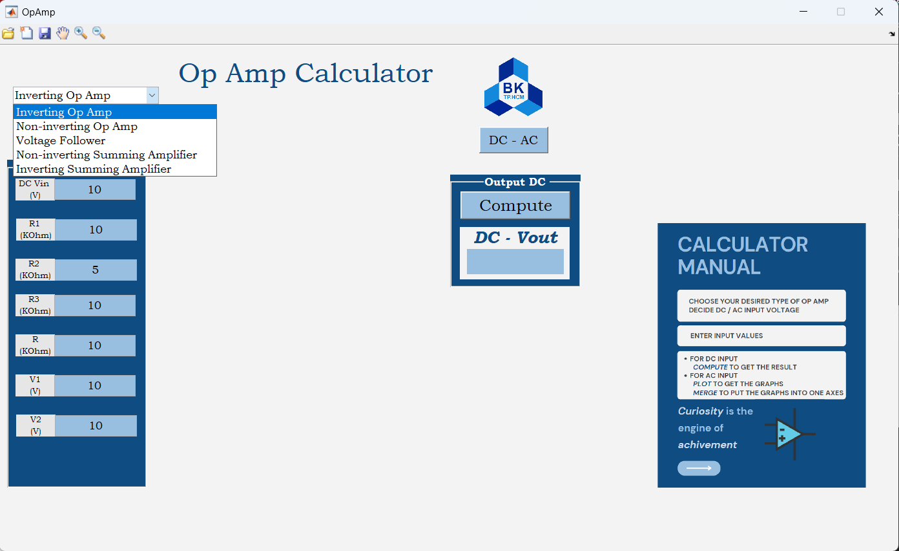
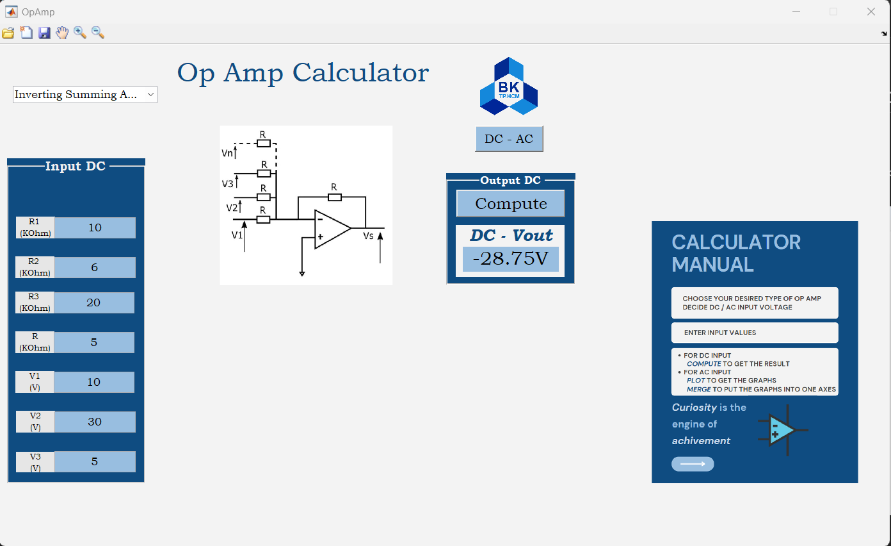
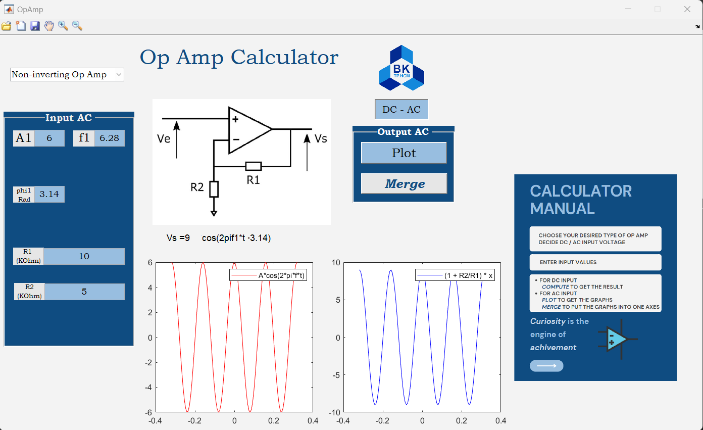
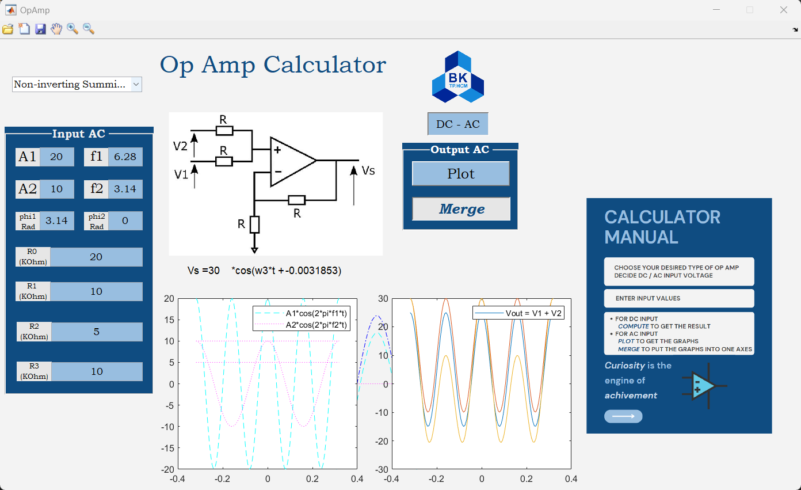

readme.md
## [MATLAB] OPERATION AMPLIFIER CIRCUITS CALCULATOR
### Introduction 
- the GUI provides options for different OpAmp configurations like inverting, non-inverting, voltage follower, and summing amplifier

   
  <i>Interface</i>

- The GUI has options for both DC and AC analysis, with the ability to compute DC values directly, plot AC signals for different OpAmp configurations, and optionally merge the graphs of input and output signals.
---
### Some demonstrations :

   
  <i>DC input Inverting Summing Amplifier</i>

   
  <i>AC input Non-Inverting Amplifier</i>

   
  <i>AC input Non-Inverting Summing Amplifier</i>

   
  <i>AC input Non-Inverting Summing Amplifier-Merged</i>

---
### Instruction 
- The main code is in the file OpAmp.m

- Users need to locate the image used in the code in the same folder or add just the path to the image properly. 
---
### Used version
Matlab R2019a